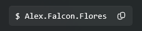

# Script


> use:
> ```xaml
> xmlns:utControls="using:UWP_Toolkit.Controls"
> ```

## Properties

### Symbol
Gets or sets the `text` of the Symbol.
- Returns: A string that specifies the `text` of the Symbol. The default is `$`

### Text
Gets or sets the `text` of the Script.
- Returns: A `string` that specifies the `text` of the Script. The default is an `empty string`.

### ButtonToolTip
Gets or sets the `text` of the **Copy button**.
- Returns: A `string` that specifies the `text` of the **Copy button**. The default is an `empty string`.

