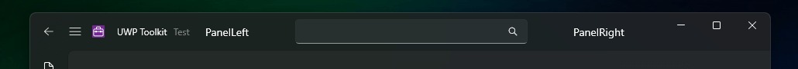
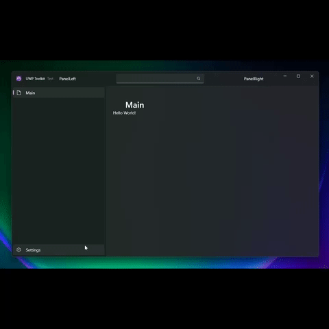

# TitleBar
Represents a Title Bar that can be used in a UWP APP. The background of the buttons automatically changes color.

[Property](#properties) |
[Gallery](#gallery)

> [!NOTE]
> xmlns:utControls="using:UWP.Toolkit.Controls"

> ```xaml
>
> <Page xmlns:utControls="using:UWP.Toolkit.Controls"
>xmlns:winui="using:Microsoft.UI.Xaml.Controls"
>winui:BackdropMaterial.ApplyToRootOrPageBackground="True">
>
><utControls:TitleBar x:Name="MyTitleBar"
>                      AppIconSource="/Assets/StoreLogo.png"
>                      AppName="Test UWP"
>                      IsBackButtonEnabled="True"
>                      IsBackButtonVisible="{x:Bind ViewMode...}"
>                      IsReleaseTagVisible="Visible"
>                      ReleaseTag="Release"
>					   BackButtonCommand="{x:Bind ViewModel.....}"
>                      Size="Tall">
><utControls:TitleBar.PanelLeft>
>    <TextBlock Text="PanelLeft" />
></utControls:TitleBar.PanelLeft>
><utControls:TitleBar.Search>
>    <AutoSuggestBox QueryIcon="Find" />
></utControls:TitleBar.Search>
><utControls:TitleBar.PanelRight>
>    <TextBlock Text="PanelRight" />
></utControls:TitleBar.PanelRight>
><utControls:TitleBar.Body>
>    <winui:NavigationView x:Name="navigationView" IsBackButtonVisible="Collapsed"
>                          IsSettingsVisible="True">
><!-- .... -->
> ```

## Properties

### Size
Gets or sets the `size` of the TitleBar.
- Returns: A value of the `enumeration`. The default is `Short`.

### TitleBarBackground
Gets or sets a `brush` that provides the `background` of the TitleBar.
- Returns: The `brush` that provides the `background` of the TitleBar. The default is `Transparent`.

### AppIconSource
Gets or sets the `source` for the App Icon on the TitleBar.
- Returns: An `object` that represents the `image` source file for the drawn image. Typically you set this with a `BitmapImage object`. Constructed with a the `Uniform Resource Identifier (URI)` that describes the path to a valid image source file. Or, you can initialize a `BitmapSource` with a `stream`, perhaps a `stream` from a `storage file`.
  
### IsAppIconVisible
Gets or sets the `visibility` of the App Icon on the TitleBar.
- Returns: A value of the enumeration. The default is `Visible`.
  
### AppName
Gets or sets the `text` of the App Name.
- Returns: A `string` that specifies the text of the App Name. The default is an `empty string`.

### IsAppNameVisible
Gets or sets the `visibility` of the App Name on the TitleBar.
- Returns: A value of the enumeration. The default is `Visible`.

### ReleaseTag
Gets or sets Gets or sets the `text` of the Release Tag.
- Returns: A string that specifies the text  of the Release Tag. The default is an empty string.

### IsReleaseTagVisible
Gets or sets the `visibility` of the Release Tag on the TitleBar.
- Returns: A value of the enumeration. The default is `Visible`.


### BackButtonCommand
Gets or sets the command to invoke when this back button is pressed.
- Returns: The command to invoke when this back button is pressed. The default is `null`.

### BackButtonCommandParameter
Gets or sets the `parameter` to pass to the `BackButtonCommand` property.
-  Returns: The parameter to pass to the `BackButtonCommand` property. The default is `null`.

### IsBackButtonVisible
Gets or sets the visibility of the back button.
- Returns: A value of the `enumeration`. The default is `Collapsed`.

### IsBackButtonEnabled
Gets or sets a value indicating whether the user can interact with the back button.
- Returns: `true` if the user can interact with the back button otherwise `false`. The default is `true`.

### PaneToggleButtonCommand
Gets or sets the command to invoke when this pane toggle button is pressed.
- Returns: The command to invoke when this pane toggle button is pressed. The default is `null`.

### PaneToggleButtonCommandParameter
Gets or sets the parameter to pass to the `PaneToggleButtonCommand` property.
- Returns: The parameter to pass to the `PaneToggleButtonCommand` property. The default is `null`.

### IsPaneToggleButtonVisible
Gets or sets the [ElementDisplayMode](../Enum/ElementDisplayMode.md) of the pane toggle button.
- `ElementDisplayMode.Auto`: It's used to verify the state of the `NavigationViewDisplayMode`. If the `NavigationViewDisplayMode` is `Expanded`, it hides the `PaneToggleButton`. If it is `Compact` or `Minimal`, it shows the `PaneToggleButton`.
- `ElementDisplayMode.Visible`: It will always `show` the `PaneToggleButton`, independently of the `NavigationViewDisplayMode` state.
- `ElementDisplayMode.Collapsed`: It will always `hide` the `PaneToggleButton`, regardless of the `NavigationViewDisplayMode` state.

> [!IMPORTANT]
> To ensure proper operation, make sure that the NavigationView's PaneDisplayMode is set to Auto, which is the default value. 
> `If you make a change to IsPaneToggleButtonVisible restart the application debugging for the changes to take effect`.

- Returns: A value of the enumeration. The default is `Auto`.

### IsPaneToggleButtonEnabled
Gets or sets a value indicating whether the user can interact with the pane toggle button.
- Returns: `true` if the user can interact with the pane toggle button otherwise `false`. The default is `true`.

### Search
Gets or sets an `AutoSuggestBox` to be displayed in the TitleBar.
- Returns:  An `AutoSuggestBox` to be displayed in the TitleBar.

### PanelLeft
Gets or sets a `UI element` that is shown in the TitleBar left panel.
- Returns: The `element` that is shown in the TitleBar left panel.

### PanelRight (`old PaneCustomContent`)
Gets or sets a `UI element` that is shown in the TitleBar right panel.
- Returns: The `element` that is shown in the TitleBar right panel.

### Body
Gets or sets the content to display under the TitleBar.

Checking the `Body` element for `Microsoft.UI.Xaml.Controls.NavigationView`. When this condition is met, the following actions are automatically triggered:

- The `PaneToggleButton` of the `NavigationView` is automatically hidden.
- The ability to `open` or `close` the `NavigationView` `Pane` is added.

> [!NOTE]
> They are only activated automatically if the `Body` contains a `Microsoft.UI.Xaml.Controls.NavigationView`.

-  Returns: An `object` that contains the control's content. The default is `null`.

## Gallery





